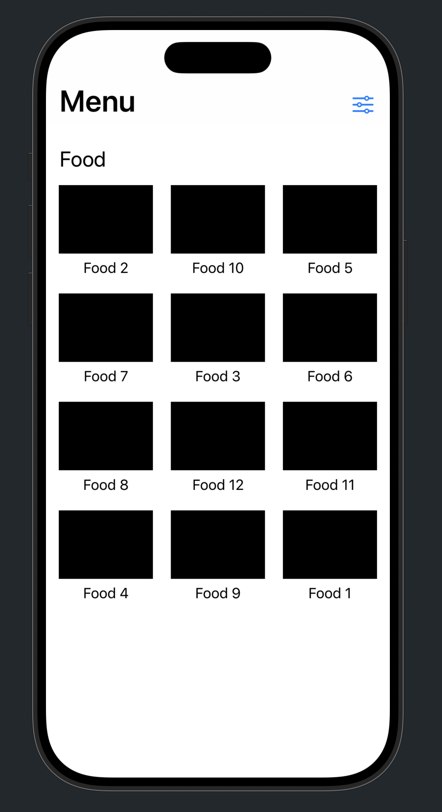
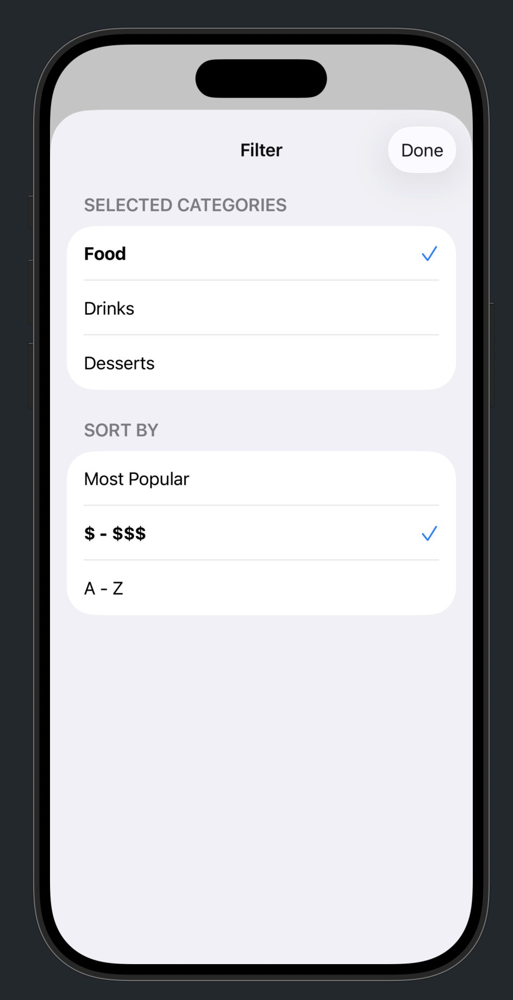
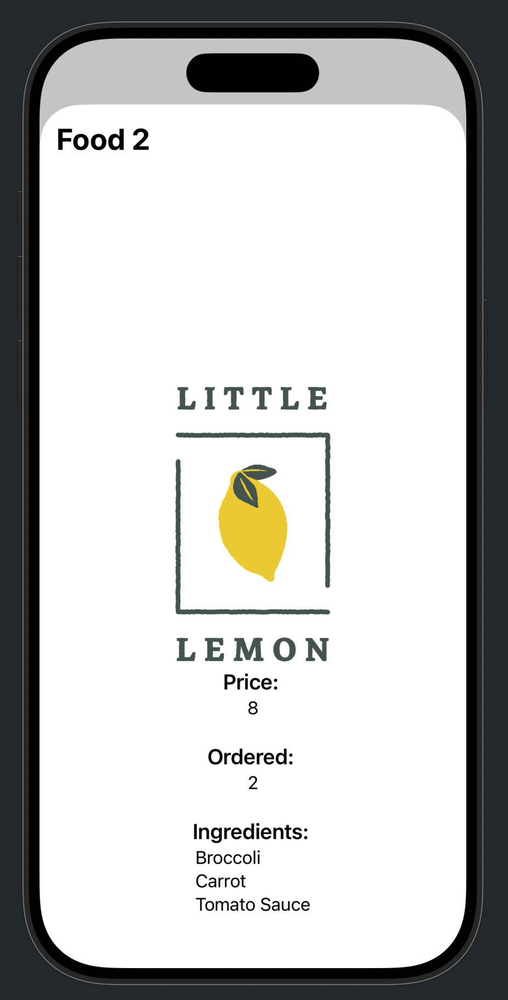

# Little Lemon Diner

An iOS restaurant menu application built with Swift and SwiftUI, featuring a comprehensive menu browsing experience with detailed item views and filtering options.

## Project Overview

This project demonstrates advanced iOS development concepts including MVVM architecture, SwiftUI framework, and Combine framework for reactive programming. The app provides users with an intuitive interface to browse restaurant menu items, view detailed descriptions, and filter content based on preferences.

## Screenshots and Demo


*Main menu items display with grid layout*


*Menu filtering and sorting options*


*Detailed view of individual menu items*

[Completed App Demo Video](VideosDemo/CompletedApp.mov)
*Full application demonstration*

## Architecture

This project follows the **MVVM (Model-View-ViewModel)** architectural pattern:

- **Models**: Data structures for menu items, ingredients, and categories
- **Views**: SwiftUI user interface components
- **ViewModels**: Business logic and data management layer

## Technologies Used

- **Swift**: Modern programming language for iOS development
- **SwiftUI**: Declarative framework for building user interfaces
- **Combine**: Reactive programming framework for handling asynchronous events
- **Xcode**: Integrated development environment for iOS development

## Project Structure

```
little-lemon-diner-main/
├── Models/           # Data models and structures
├── Views/            # SwiftUI view components
├── ViewModels/       # Business logic and data management
├── little-lemon-diner/ # Main application bundle
└── VideosDemo/       # Project screenshots and demo video
```

## Features

- Interactive menu browsing interface
- Detailed item information display
- Category-based filtering
- Sorting options for menu items
- Responsive design for various device sizes
- Modern iOS design patterns

## Development

This project was developed as the final assignment for the "Advanced Programming in Swift" course, showcasing proficiency in modern iOS development practices and frameworks.

## Author

**Tudor Iustin**  
Copyright 2025

**Important**: This project is created for educational purposes and should not be reused or copied without explicit permission.

## Project Location

The complete project source code is located in the `little-lemon-diner-main/` directory.

## Requirements

- iOS 26
- Xcode 26.0 Beta
- Swift 6.2

